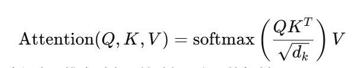
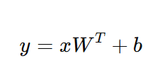
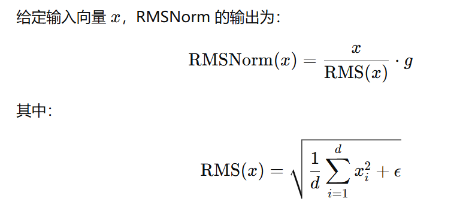
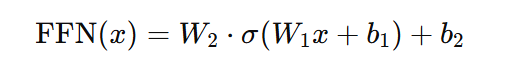
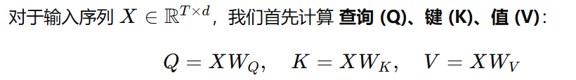
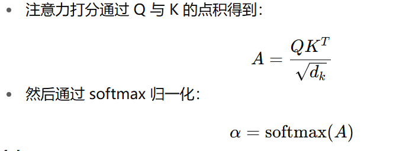
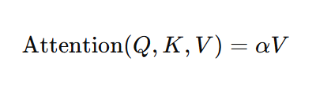
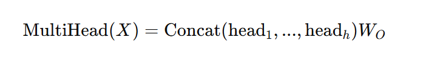

 
---
#  CS336课程文件翻译

## 📖 目录（翻译）

1. **作业概览 (Assignment Overview)**

2. **字节对编码（Byte-Pair Encoding, BPE）分词器**
   

   * [Unicode 标准](./Tokenization/main.py)
   * [Unicode 编码方式](./Tokenization/main.py)
   * [子词（Subword）分词](./Tokenization/Tokenizer.md) 
   * BPE 分词器训练 
   * BPE 分词器实验
   * BPE 分词器：编码与解码

     * 文本编码
     * 文本解码

3. **实验部分 (Experiments)**
  实验需要准备 TinyStoriesV2数据集

4. **[Transformer 语言模型架构](./Transformer/Transformer.md)**

   * Transformer LM
   * 词嵌入 (Token Embeddings)
   * 预归一化 Transformer 块 (Pre-norm Transformer Block)（做了，跳过）
   * 输出归一化与嵌入（做了，跳过）
   * 备注：批处理、Einsum 与高效计算
   * 数学符号与内存布局

5. **基本构建模块：线性与嵌入层**

   * 参数初始化
   * 线性层 (Linear Module)
   * 嵌入层 (Embedding Module)

6. **预归一化 Transformer 块**

   * 均方根层归一化 (RMSNorm)
   * 前馈网络 (FFN)
   * 相对位置嵌入
   * 缩放点积注意力
   * 因果多头自注意力

7. **完整 Transformer LM**

8. **训练 Transformer LM**

   * 交叉熵损失函数
   * SGD 优化器
   * 在 PyTorch 中实现 SGD
   * AdamW
   * 学习率调度
   * 梯度裁剪
   * 训练循环
   * 数据加载器
   * 检查点保存
   * 训练循环

9. **文本生成 (Generating text)**

10. **实验与交付物 (Experiments & Deliverables)**

* TinyStories 数据集
* Ablation 实验与架构修改
* OpenWebText 实验
* 自定义修改 + 排行榜

---

## 📖 第一章：作业概览（翻译）

### 作业目标

在本次作业中，你将从零开始构建训练标准 **Transformer 语言模型 (LM)** 所需的全部组件，并完成训练。

### 你需要实现的部分

1. **字节对编码 (BPE) 分词器** (§2)
2. **Transformer 语言模型** (§3)
3. **交叉熵损失函数 与 AdamW 优化器** (§4)
4. **训练循环**（支持模型与优化器状态的保存与加载） (§5)

### 你需要运行的任务

1. 在 **TinyStories 数据集** 上训练一个 BPE 分词器。
2. 使用训练好的分词器将数据集转换为整数 ID 序列。
3. 在 TinyStories 上训练一个 Transformer 语言模型。
4. 使用训练好的 Transformer LM 生成样例文本，并评估困惑度 (perplexity)。
5. 在 **OpenWebText** 上训练模型，并将困惑度提交到排行榜。

### 使用规范

* 要求你 **从零实现** 这些组件。
* 你 **不可以** 使用 `torch.nn`, `torch.nn.functional`, `torch.optim` 中的任何现成定义，除了：

  * `torch.nn.Parameter`
  * 容器类（如 `Module`, `ModuleList`, `Sequential` 等）
  * `torch.optim.Optimizer` 基类
* 你可以使用 PyTorch 的其他定义。
* 如果不确定某个函数/类能否使用，可以在 Slack 上提问。原则是：不要破坏“从零实现”的精神。

### 关于 AI 工具

* 允许使用 ChatGPT 等 LLM 提问 **低层编程问题** 或 **高层概念问题**。
* 禁止直接让 AI **代写作业**。
* 建议关闭 IDE 中的 AI 自动补全（如 Copilot），以便更深入理解作业内容。

### 代码说明

* 作业代码与说明文档托管在 GitHub：
  👉 [github.com/stanford-cs336/assignment1-basics](https://github.com/stanford-cs336/assignment1-basics)
* 仓库结构：

  1. `cs336_basics/*`：你要写的代码（为空，可以自由实现）。
  2. `adapters.py`：作业框架要求的功能接口，需调用你写的代码（不能在此写逻辑）。
  3. `test_*.py`：测试文件，调用 `adapters.py`，不要修改。

### 提交要求

* 上传到 Gradescope：

  * **writeup.pdf**：书面回答问题（需排版）。
  * **code.zip**：你写的所有代码。
* 提交排行榜：

  * 在 [assignment1-basics-leaderboard](https://github.com/stanford-cs336/assignment1-basics-leaderboard) 提交 PR。

### 数据集

* 使用两个已处理好的数据集：

  * **TinyStories** (Eldan & Li, 2023)
  * **OpenWebText** (Gokaslan et al., 2019)
* 数据集是纯文本文件，可在 `/data` 获取（课堂环境），或在 GitHub README 提供的命令下载（本地环境）。

---

  
---

# 第二章：字节对编码（BPE）分词器

在本作业的第一部分，你需要实现并训练一个 **字节级别（byte-level）的 BPE 分词器** \[Sennrich et al., 2016; Wang et al., 2019]。
核心思路：

* 将任意 Unicode 字符串表示为 **字节序列**；
* 在这些字节序列上训练 BPE 分词器；
* 最终用该分词器将字符串编码成整数序列（token IDs），供语言模型使用。

---

## 2.1 Unicode 标准

Unicode 是一个文本编码标准，用于把字符映射为整数编码点（code points）。
截至 Unicode 16.0（2024 年 9 月发布），该标准共定义了 **154,998 个字符**，覆盖 **168 种文字系统**。

* 例如：

  * 字符 “s” 的编码点是 **115**，写作 `U+0073`（`0073` 是十六进制）。
  * 汉字 “牛” 的编码点是 **29275**。

在 Python 里：

* `ord()`：字符 → 整数编码点。
* `chr()`：整数编码点 → 对应字符。

```python
>>> ord('牛')
29275
>>> chr(29275)
'牛'
```

📌 **作业题 (unicode1, 1分)**
(a) `chr(0)` 返回什么字符？
(b) 它的 `__repr__()` 和打印结果有什么区别？
(c) 当该字符出现在字符串中会发生什么？

---

## 2.2 Unicode 编码

Unicode 标准本身只定义 **字符 ↔ 编码点** 的映射，但直接用编码点训练分词器不切实际：

* 词表太大（约 15 万项）；
* 很稀疏（很多字符极少出现）。

因此，我们使用 **Unicode 编码方式**，即将字符转换为 **字节序列**。
常见编码方式：

* UTF-8（互联网主流，占网页的 98% 以上）；
* UTF-16；
* UTF-32。

在 Python 中：

* `encode("utf-8")`：字符串 → 字节串
* `list(b)`：查看字节值（0\~255 的整数）
* `decode("utf-8")`：字节串 → 字符串

示例：

```python
>>> test_string = "hello! こんにちは!"
>>> utf8_encoded = test_string.encode("utf-8")
>>> list(utf8_encoded)
[104, 101, 108, 108, 111, 33, 32, 227, 129, 147, 227, 130, 147, 227, 129, 171, 227, 129, 161, 227, 129, 175, 33]
>>> utf8_encoded.decode("utf-8")
'hello! こんにちは!'
```

关键点：

* 字节表大小固定为 **256**（0\~255）。
* 因此，任何输入文本都能被唯一表示。
* 这避免了 OOV（out-of-vocabulary）问题。

📌 **作业题 (unicode2, 3分)**
(a) 为什么我们更倾向于用 **UTF-8 字节** 训练分词器，而不是 UTF-16 或 UTF-32？
(b) 下列函数为什么错误？给一个例子。

```python
def decode_utf8_bytes_to_str_wrong(bytestring: bytes):
    return "".join([bytes([b]).decode("utf-8") for b in bytestring])
```

(c) 给出一个不能解码为 Unicode 字符的 **2 字节序列**。

---

## 2.3 子词分词（Subword Tokenization）

* **问题**：

  * 字节级分词避免了 OOV，但序列太长。
  * 一个 10 词句子，在词级模型中可能是 10 tokens，在字节级可能要 50+ tokens。
  * 更长序列 → 更慢训练 + 长依赖问题更严重。

* **子词分词器 = 折中方案**

  * 词表比字节大，但能更好压缩序列长度。
  * 例如：若 “the” 高频出现，就可以作为单个 token 存储，而不是 \[t, h, e] 三个 token。

* **BPE（Byte-Pair Encoding）**

  * 最初是一种压缩算法（Gage, 1994）。
  * 原理：迭代合并出现频率最高的字节对 → 新 token。
  * 高频词逐渐变成单个子词单元。

👉 最终得到的就是 **BPE 分词器 (BPE Tokenizer)**。

---

## 2.4 BPE 分词器训练

主要步骤：

1. **词表初始化**

   * 初始词表：所有 256 个字节。
   * 一一映射：字节 → 整数 ID。

2. **预分词（Pre-tokenization）**

   * 直接全语料统计字节对频率太慢。
   * 解决方案：先进行 **粗分词**（如用正则分词），加速统计。
   * GPT-2 使用的正则模式：

     ```regex
     '(?:[sdmt]|ll|ve|re)| ?\p{L}+| ?\p{N}+| ?[^\s\p{L}\p{N}]+|\s+(?!\S)|\s+'
     ```

3. **计算 BPE 合并**

   * 找出出现次数最多的字节对 `(A, B)`，合并为新 token `AB`。
   * 重复此过程，直到词表达到设定大小。
   * 为保证确定性：若多组频率相同，选择 **字典序较大** 的 pair。

4. **特殊符号（Special Tokens）**

   * 如 `<|endoftext|>`，应当永远保留为单一 token，不能被拆分。

---

## 2.5 实验：训练 BPE 分词器

* 任务：在 **TinyStories 数据集** 上训练一个最大词表 10K 的 BPE 分词器。
* 任务：在 **OpenWebText 数据集** 上训练一个最大词表 32K 的分词器。
* 交付物：

  * 训练耗时、内存占用。
  * 词表中最长的 token（是否合理）。
  * 性能瓶颈分析。
* 资源需求：

  * TinyStories：≤30分钟，无需GPU，≤30GB内存
  * OpenWebText：≤12小时，无需GPU，≤100GB内存

---

## 2.6 BPE 分词器：编码与解码

### 编码流程

1. **预分词**：文本 → 预分词单元 → UTF-8 字节序列。
2. **应用合并规则**：依次执行 BPE 合并 → token IDs。

### 解码流程

* 将 token IDs 映射回字节串 → 拼接 → 解码为字符串。
* ⚠️ 如果 ID 序列无法解码（非法字节序列），用 **U+FFFD 替换符号**。

---

## 2.7 分词器实验

1. 用 **TinyStories / OpenWebText 分词器** 各自编码 10 个样本文档，计算压缩率（bytes/token）。
2. 用 TinyStories 分词器去编码 OpenWebText，比较压缩率。
3. 估算分词器吞吐量（bytes/s），推算处理 **The Pile (825GB)** 所需时间。

---

 好的，我来翻译 **第四章 Transformer 语言模型架构** 部分。

---
 
---

# 第三章 实验 (Experiments)

在这一章中，你需要运行实验来验证自己实现的 **BPE 分词器** 和 **Transformer 语言模型** 是否正确工作，并且复现出类似论文或教材中的结果。

---

## 3.1 TinyStories 上的实验

1. **数据集**

   * 使用 TinyStories 数据集（Eldan & Li, 2023）。
   * 数据由儿童故事组成，规模小、容易快速实验。

2. **任务目标**

   * 先在 TinyStories 上训练 BPE 分词器。
   * 再用该分词器训练一个小规模的 Transformer LM。

3. **评估指标**

   * **压缩率 (compression ratio)**：平均每个 token 对应多少字节。
   * **困惑度 (perplexity)**：标准语言建模指标，越低越好。

4. **实验要求**

   * 记录训练时间、内存占用。
   * 尝试不同超参数（如 vocab size, d\_model）。
   * 对比不同分词器的效果。

---

## 3.2 OpenWebText 上的实验

1. **数据集**

   * 使用 OpenWebText 的一个子集（Gokaslan & Cohen, 2019）。
   * 这是 GPT-2 使用过的数据集，规模较大，更接近真实场景。

2. **任务目标**

   * 在该数据集上训练更大规模的分词器（例如 vocab=32k）。
   * 训练一个更大的 Transformer LM。

3. **实验要求**

   * 记录耗时与 GPU/CPU 占用。
   * 分析性能瓶颈（是分词、数据加载，还是模型训练）。
   * 对比不同 vocab size 的压缩率与 perplexity。

---

## 3.3 消融实验 (Ablation Studies)

1. **为什么做消融实验？**

   * 验证模型的某个设计是否必要。
   * 例如：去掉特殊 token、减少层数、换归一化方法。

2. **具体要求**

   * 至少做一个消融实验。
   * 比较实验结果，并解释差异。

---

## 3.4 结果复现与报告

* 你需要写一份简短实验报告，总结：

  * 分词器训练结果（词表大小、压缩率）。
  * 语言模型训练结果（困惑度、泛化性能）。
  * 消融实验发现。

* 报告格式：

  * 可以是 Markdown 文件。
  * 或者写在代码注释 / Jupyter Notebook 里。

---

 
## 第四章 Transformer 语言模型架构（翻译）

### Transformer LM

在本作业中，我们将实现一个标准的 **Transformer 语言模型 (LM)**。
模型由以下几个部分组成：

1. **嵌入层 (Embedding layer)**：将 token IDs 转换为向量表示。
2. **一系列 Transformer 块**：每个块包含多头自注意力和前馈网络。
3. **最终线性层与 softmax 输出**：预测下一个 token 的概率分布。

---

### Token Embeddings（词嵌入）

* 输入是整数 ID（来自 BPE 分词器）。
* 每个 ID 被映射到一个维度为 `d_model` 的向量。
* 嵌入矩阵大小为 `(vocab_size, d_model)`。
* 我们还需要加上 **位置编码 (positional embeddings)**，以便模型感知序列顺序。

---

### Pre-norm Transformer Block（预归一化 Transformer 块）

* 每个 Transformer 块由两部分组成：

  1. **多头自注意力层 (Multi-head Self Attention)**
  2. **前馈网络 (Feedforward Network, FFN)**
* 每个子层之前应用 **RMSNorm（均方根归一化）**，再进入子层。
* 使用 **残差连接**：

  $$
  x = x + \text{Sublayer}(\text{Norm}(x))
  $$

---

### 输出归一化与嵌入（Output Normalization & Embedding）

* 在最后一个 Transformer 块之后，应用一个归一化层。
* 接着是一个 **线性层 (Linear Layer)**，其权重共享输入嵌入矩阵（即 **权重绑定 weight tying**）。
* 该线性层将隐藏状态投影到词表大小的向量，用于 softmax。

---

### 备注：批处理、Einsum 与高效计算

* 在实现注意力和 FFN 时，需要关注 **矩阵乘法效率**。
* 推荐使用 `torch.einsum` 或 `torch.matmul`，确保维度清晰、可读性高。
* 需要支持批处理输入 `(batch_size, seq_len, d_model)`。

---

### 数学符号与内存布局

* 输入张量形状： `(B, T, C)`

  * `B = batch_size`
  * `T = 序列长度`
  * `C = d_model`
* 注意力机制需要计算 `Q, K, V`：

  * `Q = X W_Q`
  * `K = X W_K`
  * `V = X W_V`
* 注意力权重：

  
* 在实现时，需要确保张量维度对齐，并避免不必要的复制。

---
 
---

# 第五章 基本构建模块 (Basic Building Blocks)

在实现完整的 Transformer 语言模型之前，我们需要先构建一些 **核心模块 (building blocks)**。这些模块是神经网络的最小单元，会在整个模型中被多次复用。

---

## 5.1 线性层 (Linear Layer)

1. **功能**

   * 线性层实现仿射变换：

     

     其中 $x$ 是输入，$W$ 是权重矩阵，$b$ 是偏置。

2. **实现要求**

   * 使用 `torch.nn.Module` 自定义实现，而不是直接用 `nn.Linear`。
   * 参数初始化：

     * 权重 $W$ 使用 **Kaiming 初始化** 或 **Xavier 初始化**。
     * 偏置 $b$ 初始化为 0。

3. **输入输出形状**

   * 输入：`(B, T, in_dim)`
   * 输出：`(B, T, out_dim)`

---

## 5.2 嵌入层 (Embedding Layer)

1. **功能**

   * 将 token ID（整数）映射到向量表示。
   * 实现类似 `nn.Embedding` 的功能。

2. **实现细节**

   * 参数矩阵形状 `(vocab_size, d_model)`。
   * 输入是 `(B, T)` 的整数张量，输出是 `(B, T, d_model)`。

3. **权重共享 (Weight Tying)**

   * 在语言模型中，嵌入矩阵会与输出层线性变换共享权重。
   * 这样可以减少参数数量，并提升泛化性能。

---

## 5.3 RMSNorm（均方根归一化）

1. **为什么不用 LayerNorm？**

   * LayerNorm 依赖于均值和方差，计算开销较大。
   * RMSNorm 只使用均方根 (root mean square)，计算更高效。

2. **定义**
   给定输入向量 $x$，RMSNorm 的输出为：

  

   * $g$ 是可学习的缩放参数。
   * $\epsilon$ 是数值稳定性常数。

3. **实现要求**

   * 不要用 PyTorch 自带的 `nn.LayerNorm`。
   * 自己实现 RMSNorm，并支持 `(B, T, C)` 的输入。

---

## 5.4 前馈网络 (Feedforward Network, FFN)

1. **结构**

   * FFN 通常包含两层线性变换和一个激活函数：

    

2. **细节**

   * 隐藏层维度一般取 $4 \times d_{model}$。
   * 激活函数使用 **GELU** 或 **ReLU**。

3. **实现要求**

   * 输入形状 `(B, T, d_model)`，输出相同。
   * 确保高效支持批处理。

---
好，我们接着翻译 **第六章：注意力机制 (Attention Mechanism)**。

---

# 第六章 注意力机制 (Attention Mechanism)

注意力机制是 Transformer 的核心。它允许模型在预测下一个 token 时“关注”输入序列中的相关位置，而不是仅依赖固定的上下文窗口。

---

## 6.1 自注意力 (Self-Attention)

1. **定义**
    
   

2. **注意力权重**

  

3. **输出**

   * 最终输出为：

    

---

## 6.2 缩放点积注意力 (Scaled Dot-Product Attention)

* 之所以要除以 $\sqrt{d_k}$，是为了避免在高维空间中点积过大，导致 softmax 进入梯度消失区间。
* 在实现中：

  * 输入形状 `(B, T, d_model)`。
  * 输出形状 `(B, T, d_model)`。

---

## 6.3 掩码 (Masking)

1. **因果掩码 (Causal Mask)**

   * 在语言模型中，预测位置 $t$ 不能看到未来的 token。
   * 因此，需要掩盖未来位置：

     $$
     \alpha_{ij} = 0 \quad \text{if } j > i
     $$

2. **实现方式**

   * 使用一个上三角矩阵，mask 掉未来的 logits。
   * 在 PyTorch 中，可以用 `torch.triu` 构造掩码。

---

## 6.4 多头注意力 (Multi-Head Attention)

1. **动机**

   * 单一的注意力头可能无法捕捉到所有依赖关系。
   * 多头机制允许模型在不同子空间中学习不同的注意力模式。

2. **实现**

   * 将输入投影到 $h$ 个子空间：

     $$
     Q_h, K_h, V_h
     $$
   * 在每个子空间独立计算注意力。
   * 将所有头的结果拼接，再通过线性层投影回原维度。

3. **公式**

   
---

## 6.5 实现注意事项

* **张量形状**：

  * 输入：`(B, T, d_model)`
  * 经过拆分头部后：`(B, h, T, d_head)`
  * 输出拼接回 `(B, T, d_model)`

* **高效计算**

  * 尽量使用 `einsum` 或 `matmul` 避免显式 for 循环。
  * 注意保存中间结果，减少重复计算。

---

## 9.文本生成

我帮你逐段拆解这段 `decode` 代码，解释它在做什么（相当于一个简化版的 GPT 文本生成函数）：

---

### 1. 装饰器

```python
@torch.no_grad()
```

* 作用：关闭梯度计算，节省显存、加快推理速度。
* 推理阶段不需要反向传播，所以加上它。

---

### 2. 函数定义

```python
def decode(
    model,
    tokenizer,
    prompt: str,
    max_new_tokens: int = 50,
    temperature: float = 1.0,
    top_p: float = 1.0,
    device: str = 'cuda' if torch.cuda.is_available() else 'cpu'
) -> str:
```

参数说明：

* `model`: Transformer 语言模型。
* `tokenizer`: 编码/解码工具，能把字符串转为 token IDs，再解码回文本。
* `prompt`: 输入的上下文。
* `max_new_tokens`: 最多生成多少新 token。
* `temperature`: 控制随机性，>1 更随机，<1 更确定。
* `top_p`: nucleus sampling 的阈值，保留累计概率 ≤ p 的 token。
* `device`: GPU/CPU。

---

### 3. 初始化

```python
model.eval()
model.to(device)

input_ids = tokenizer.encode(prompt)
input_ids = torch.tensor([input_ids], dtype=torch.long, device=device)

eos_id = tokenizer.encode("<|endoftext|>")[0]
```

* `model.eval()`：切换到推理模式（关闭 dropout 等）。
* `input_ids`：把 prompt 编成 token id，并放入 GPU/CPU。
* `eos_id`：取 `<|endoftext|>` 的 token id，用来判断是否结束生成。

---

### 4. 逐步生成 token

```python
for _ in range(max_new_tokens):
    logits = model(input_ids)        # (1, seq_len, vocab_size)
    logits = logits[:, -1, :]        # 取最后一个位置的预测分布
```

* `model(input_ids)`：前向计算，得到每个位置的词预测 logits。
* 只取最后一个位置的 logits，因为我们只关心“接下来可能的下一个词”。

---

### 5. 应用温度系数

```python
logits = logits / max(temperature, 1e-8)
probs = F.softmax(logits, dim=-1)
```

* 温度缩放：

  * 如果 `temperature < 1` → 分布更尖锐，更确定。
  * 如果 `temperature > 1` → 分布更平滑，更随机。
* `softmax` 把 logits 转为概率分布。

---

### 6. Top-p (核采样)

```python
sorted_probs, sorted_indices = torch.sort(probs, descending=True)
cumulative_probs = torch.cumsum(sorted_probs, dim=-1)

cutoff = cumulative_probs > top_p
cutoff[..., 1:] = cutoff[..., :-1].clone()
cutoff[..., 0] = False
```

* `torch.sort`：按概率从大到小排序。
* `cumulative_probs`：累计概率。
* `cutoff`: 标记累计概率超过 `top_p` 的部分。

  * 例如 `top_p=0.9`，则只保留累计概率 ≤0.9 的 token。
  * 这样避免长尾的低概率 token。
* `cutoff[..., 0] = False`：保证至少保留最高概率的那个词。

---

### 7. 归一化 & 采样

```python
sorted_probs[cutoff] = 0
sorted_probs = sorted_probs / sorted_probs.sum(dim=-1, keepdim=True)

next_token = torch.multinomial(sorted_probs, num_samples=1)
next_token = sorted_indices.gather(-1, next_token)
```

* 把超出 top\_p 的 token 概率置零。
* 重新归一化。
* `torch.multinomial`：按分布采样一个 token id。
* `sorted_indices.gather`：把采样结果映射回原始 token id。

---

### 8. 拼接 & 停止条件

```python
input_ids = torch.cat([input_ids, next_token], dim=-1)

if next_token.item() == eos_id:
    break
```

* 把新 token 拼到已有序列后面。
* 如果采样到 `<|endoftext|>`，则提前结束。

---

### 9. 解码返回

```python
return tokenizer.decode(input_ids[0].tolist())
```

* 把最终 token id 序列解码成字符串。
* 输出包含 prompt + 生成的新内容。

---

✅ **总结一下**
这段 `decode` 就是一个 **逐 token 生成文本的推理循环**，流程是：

1. 输入 prompt → 编码成 token ids
2. 模型预测下一个词的概率分布
3. 应用温度缩放 + Top-p 过滤
4. 从分布中采样一个 token
5. 拼接到序列，继续预测
6. 如果遇到 `<|endoftext|>` 或生成到上限，就停止
7. 解码成字符串输出

它实现了 GPT 类模型常见的 **温度采样 + nucleus sampling** 的文本生成。

---

 
 