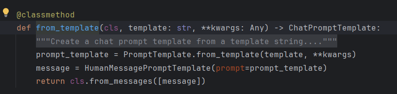

---

# 📘 LangChain + Tongyi 使用笔记

## 📖 参考资料

* [LangChain 中文文档](https://python.langchain.ac.cn/docs/introduction/)
* [吴恩达《LLM Cookbook》教程](https://datawhalechina.github.io/llm-cookbook/#/C2/readme)
---

## 章节设计
 * 环境准备
 * 基础调用
 * 提示词模板
 * 输出解析器

## 🚀 环境准备

在国内环境下，不使用 OpenAI 的 key，而是使用 **通义千问 (Qwen / Tongyi)** 的 API key。

1. 在 `record.env` 文件中配置环境变量：
   ```env
   QWEN_API_KEY=your_qwen_key
   QWEN_URL=your_qwen_url
   ```

2. 在代码里加载并设置：

   ```python
   from dotenv import load_dotenv
   import os

   if load_dotenv("../record.env"):
       os.environ["DASHSCOPE_API_KEY"] = os.environ["QWEN_API_KEY"]
   ```

---

## ⚙️ 基础调用

新版 LangChain 已弃用 `langchain.llms`，应使用 `langchain_community.llms.Tongyi`：

```python
from langchain_community.llms import Tongyi

llm = Tongyi(model="qwen-turbo", temperature=0.7)
print(llm.invoke("hello world"))
```

---

## 🔗 使用 PromptTemplate + Chain

封装一个简单的函数，把 **模板** 和 **模型** 串成一个 chain：

```python
def invoke_and_chain(model, temperature, prompt_p, var_dict):
    client = Tongyi(model=model, temperature=temperature)
    prompt = PromptTemplate.from_template(prompt_p)
    chain = prompt | client
    return chain.invoke(var_dict)
```

调用示例：

```python
model = "qwen-turbo"
temperature = 0.7
prompt_p = '''
{var1} * {var2} 等于多少？
'''
vardict = {"var1": 5, "var2": 7}

response = invoke_and_chain(
    model=model, 
    temperature=temperature, 
    prompt_p=prompt_p, 
    var_dict=vardict
)
print(response)
```

输出：

```
35
```

---

## 💡 提示技巧

* `PromptTemplate` 支持变量插值，可快速复用模板。
* 使用 `"Let's think step by step"` 等思维链提示，可以提升推理准确率。
* 对于对话式场景，可改用 `ChatTongyi` + `SystemMessage/HumanMessage`。

---
 
如图所示，from_template默认采用humanmessage来创建消息


# LangChain Prompt 用法总结

Prompt 是大模型（LLM）的输入，可以是简单字符串，也可以是多轮对话消息。在 LangChain 中，Prompt 的设计方式影响模型的输出效果。

---

## 一、PromptTemplate（单轮字符串模板）

* **用途**：构建固定格式的字符串 prompt，变量用 `{key}` 占位符。
* **创建方式**：

  1. `PromptTemplate.from_template(template)`
  2. `PromptTemplate(template=..., input_variables=[...])`
* **调用方式**：

  * `.format(**vars)`
  * 串联到 `chain` 使用

**示例：**

```python
prompt = "---{disease}---有---{symptom}---症状，需要使用---{medicine}---药品进行治疗"
var_dict = {"disease": "糖尿病", "symptom": "尿血", "medicine": "格列美脲"}

prompt_template = PromptTemplate.from_template(prompt)
print(prompt_template.format(**var_dict))
```

---

## 二、FewShotPromptTemplate（示例提示）

* **用途**：通过给定输入输出示例，引导模型学习格式。
* **关键点**：

  * `examples`：样例列表
  * `example_prompt`：样例格式
  * `suffix`：留出用户输入的位置

**示例：**

```python
examples = [
    {"word": "cat", "translation": "猫"},
    {"word": "dog", "translation": "狗"}
]
example_prompt = PromptTemplate.from_template("英文: {word} -> 中文: {translation}")

fewshot_prompt = FewShotPromptTemplate(
    examples=examples,
    example_prompt=example_prompt,
    suffix="英文: {word} -> 中文:",
    input_variables=["word"]
)
print(fewshot_prompt.format(word="apple"))
```

---

## 三、ChatPromptTemplate（多轮对话）

* **用途**：模拟对话场景，由 system / human / ai 消息构成。
* **常见场景**：问答助手、任务型对话。

**示例：**

```python
chat_prompt = ChatPromptTemplate.from_messages([
    ("system", "你是一个医学助手。"),
    ("human", "病人患有{disease}，出现了{symptom}，应该如何治疗？")
])
print(chat_prompt.format(disease="糖尿病", symptom="尿血"))
```

---

## 四、MessagePromptTemplate（精细化消息控制）

* **用途**：精确指定消息角色，例如 System/Human/AI。
* **适合场景**：需要控制角色语气或功能时。

**示例：**

```python
chat_prompt = ChatPromptTemplate.from_messages([
    SystemMessagePromptTemplate.from_template("你是一个翻译助手。"),
    HumanMessagePromptTemplate.from_template("请翻译这句话: {sentence}")
])
print(chat_prompt.format(sentence="我今天很开心"))
```

---

## 五、MessagesPlaceholder（插入对话历史）

* **用途**：在 Prompt 中动态插入对话历史，实现记忆功能。
* **常用于**：多轮对话，带上下文记忆。

**示例：**

```python
chat_with_memory = ChatPromptTemplate.from_messages([
    ("system", "你是一个友好的助手。"),
    MessagesPlaceholder(variable_name="history"),
    ("human", "请继续回答: {question}")
])
history = [
    {"role": "human", "content": "你好"},
    {"role": "ai", "content": "你好，我能帮你什么？"}
]
print(chat_with_memory.format(history=history, question="今天天气怎么样？"))
```

---

# LangChain Parser 用法总结

在 LangChain 中，**Parser（解析器）** 用于将大模型输出的 **非结构化文本** 转换为 **结构化结果**（如 JSON、字典、表格等），方便后续程序使用。

---

## 🌟 常用解析器（最常见）

1. **StructuredOutputParser**

   * 和 `ResponseSchema` 搭配，定义一组字段，强制 LLM 输出标准 JSON。
   * 适合需要固定字段的任务。
   * ✅ 使用率最高。

2. **PydanticOutputParser**

   * 和 Pydantic 模型结合，能自动校验 & 转换。
   * 适合复杂结构和数据验证。
   * ✅ 生产项目里很常见。

3. **ListOutputParser / CommaSeparatedListOutputParser / NumberedListOutputParser**

   * 把模型输出的列表（换行 / 逗号 / 编号格式）解析成 Python list。
   * ✅ 轻量且常用。

4. **MarkdownListOutputParser**

   * 专门解析 Markdown 列表。
   * 用于 LLM 输出 markdown 时。

5. **RetryOutputParser / OutputFixingParser**

   * 当模型输出不符合预期时，会自动重试或修复。
   * ✅ 解决“不守规矩”的 LLM 输出问题，很实用。

---

## 🛠 次常用解析器（特定场景）

6. **BooleanOutputParser**

   * 只解析布尔值（True/False/Yes/No）。

7. **EnumOutputParser**

   * 把输出限制在一组枚举值中。

8. **DatetimeOutputParser**

   * 把字符串解析为日期/时间。

9. **RegexParser / RegexDictParser**

   * 使用正则匹配 LLM 输出，适合半结构化文本。

10. **XMLOutputParser / YamlOutputParser / JsonOutputToolsParser / JsonOutputKeyToolsParser**

* 解析 XML / YAML / JSON 工具格式输出。

---

## 🔬 较少用到的（高级/实验性）

11. **CombiningOutputParser**

* 可以组合多个解析器。

12. **PandasDataFrameOutputParser**

* 把输出解析为 Pandas DataFrame（表格类任务）。

13. **PydanticToolsParser / GuardrailsOutputParser**

* 更复杂的验证场景（如 [GuardrailsAI](https://shreyar.github.io/guardrails/) 约束）。

---

## 📌 总结（建议记住的）

* **StructuredOutputParser**（最常用 JSON 解析）
* **PydanticOutputParser**（带验证的 JSON 解析）
* **ListOutputParser / CommaSeparatedListOutputParser**（解析列表）
* **RetryOutputParser / OutputFixingParser**（修复错误输出）

👉 如果只想掌握核心，记住上面这 5 个就够用了。

---
 
---

## 一、ResponseSchema（定义输出字段）

* **用途**：定义希望模型输出的字段名和说明。
* **写法**：为每个字段创建 `ResponseSchema` 对象。

**示例：**

```python
from langchain.output_parsers import ResponseSchema

# 定义输出结构
response_schemas = [
    ResponseSchema(name="disease", description="疾病名称"),
    ResponseSchema(name="symptom", description="相关症状"),
    ResponseSchema(name="medicine", description="推荐药物")
]
```

---

## 二、StructuredOutputParser（结构化解析器）

* **用途**：告诉模型必须严格按指定格式输出，并自动解析成 Python 字典。
* **结合 ResponseSchema 使用**：

  1. `StructuredOutputParser.from_response_schemas(...)`
  2. 获取 `format_instructions`，拼进 Prompt，引导模型输出 JSON 格式。

**示例：**

```python
from langchain.output_parsers import StructuredOutputParser

# 创建解析器
output_parser = StructuredOutputParser.from_response_schemas(response_schemas)
format_instructions = output_parser.get_format_instructions()

print("格式说明：", format_instructions)
```

输出示例（模型被要求返回这种 JSON）：

```json
{
  "disease": "...",
  "symptom": "...",
  "medicine": "..."
}
```

---

## 三、Parser 与 Prompt 配合

将 `format_instructions` 加入 Prompt，引导模型严格遵守输出格式。

**示例：**

```python
from langchain_core.prompts import PromptTemplate

template = """
你是一个医学助手。
请根据信息生成 JSON 输出。
信息：疾病={disease}，症状={symptom}，推荐药物={medicine}

输出要求：
{format_instructions}
"""

prompt = PromptTemplate(
    template=template,
    input_variables=["disease", "symptom", "medicine"],
    partial_variables={"format_instructions": format_instructions}
)

final_prompt = prompt.format(
    disease="糖尿病", symptom="尿血", medicine="格列美脲"
)
print(final_prompt)
```

---

## 四、解析模型返回结果

模型调用后，先得到原始字符串，再通过 `output_parser.parse(...)` 转换为结构化结果。

**示例：**

```python
# 模拟大模型输出
llm_output = '{"disease": "糖尿病", "symptom": "尿血", "medicine": "格列美脲"}'

parsed_result = output_parser.parse(llm_output)
print(parsed_result)   # {'disease': '糖尿病', 'symptom': '尿血', 'medicine': '格列美脲'}
```

明白啦 ✅ 我来帮你把 **解析器部分**整理成跟你之前 README 同一风格（标题 + 分段解释 + 小代码块 + 输出效果），保持排版统一。

你可以直接把下面这段接到你的 README 里。

---

````markdown
## 四、解析模型返回结果

模型调用后，先得到原始字符串，再通过 `output_parser.parse(...)` 转换为结构化结果。

**示例：**

```python
# 模拟大模型输出
llm_output = '{"disease": "糖尿病", "symptom": "尿血", "medicine": "格列美脲"}'

parsed_result = output_parser.parse(llm_output)
print(parsed_result)   
# {'disease': '糖尿病', 'symptom': '尿血', 'medicine': '格列美脲'}
````

---

### 五. PydanticOutputParser（带验证的 JSON 解析）

* 定义一个 **Pydantic 模型**，包含字段和校验规则
* 使用 `PydanticOutputParser(pydantic_object=Model)` 创建解析器
* 输出会强制转为 Python 对象，并做 **类型验证**

```python
from pydantic import BaseModel, Field
from langchain.output_parsers import PydanticOutputParser

class Diagnosis(BaseModel):
    disease: str = Field(description="疾病名称")
    medicine: str = Field(description="推荐药物")

parser = PydanticOutputParser(pydantic_object=Diagnosis)

print(parser.get_format_instructions())
# "请以 JSON 格式输出，字段: disease (string), medicine (string)"
```

---

### 六. ListOutputParser / CommaSeparatedListOutputParser（解析列表）

* **ListOutputParser**：解析 markdown 风格的列表
* **CommaSeparatedListOutputParser**：解析逗号分隔字符串


其中ListOutputParser由于LangChain更新，变成了一个抽象类，不能直接使用，普通的解析还是直接使用csv_parser比较好
```python
from langchain.output_parsers import ListOutputParser, CommaSeparatedListOutputParser

list_parser = ListOutputParser()
csv_parser = CommaSeparatedListOutputParser()

print(list_parser.parse("- 苹果\n- 香蕉\n- 橘子"))
# ["苹果", "香蕉", "橘子"]

print(csv_parser.parse("苹果, 香蕉, 橘子"))
# ["苹果", "香蕉", "橘子"]
```

---

### 七. RetryOutputParser / OutputFixingParser（修复错误输出）

有时模型返回的 JSON 不合法，会导致解析失败。

* **RetryOutputParser**：自动重试一次，附带更严格的提示
* **OutputFixingParser**：调用额外 LLM 来修复格式错误

```python
from langchain.output_parsers import OutputFixingParser
from langchain_openai import ChatOpenAI

fix_parser = OutputFixingParser.from_llm(parser=parser, llm=ChatOpenAI())

bad_output = "{disease: 感冒, medicine: '板蓝根'}"  # 缺少引号
print(fix_parser.parse(bad_output))
# {'disease': '感冒', 'medicine': '板蓝根'}
```

---

✅ 总结

* **PydanticOutputParser** → 最适合生产环境，强制 JSON 格式 + 类型验证
* **ListOutputParser / CommaSeparatedListOutputParser** → 快速提取列表结果
* **RetryOutputParser / OutputFixingParser** → 保证健壮性，自动修复模型输出

---

 
