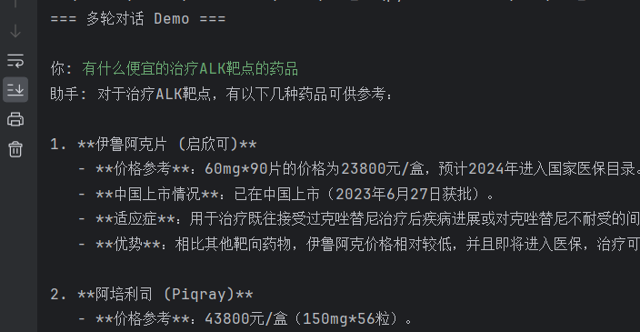

 
---

# 医药问答 Agent 项目文档



---

## 📑 目录

1. [项目简介](#项目简介)
2. [整体流程](#整体流程)
3. [环境依赖](#环境依赖)
4. [数据准备](#数据准备)
5. [数据清洗与结构化](#数据清洗与结构化)
6. [RAG 索引构建](#rag-索引构建)
7. [Agent 设计与工具调用](#agent-设计与工具调用)
8. [对话裁剪机制](#对话裁剪机制)
9. [运行示例](#运行示例)
10. [总结与扩展](#总结与扩展)

---

## 📌 项目简介

本项目旨在实现一个 **医药问答 Agent**，能够根据用户的问题自动识别药物名称或靶点，并从结构化数据中检索信息，最终给出增强型回答。

特点：

* 结合 **LangChain + DashScope + FAISS**
* 数据清洗采用 **LLM + Prompt + Parser**
* 构建 **基于药物名和靶点的 RAG 索引**
* Agent 能自动决定是否调用工具进行检索
* 支持 **多轮对话**，并实现 **上下文裁剪**

---

## 🔄 整体流程

1. **爬取数据**

   * 已完成：存储为 `txt` 原始文件

2. **数据清洗**

   * 使用 **Prompt + LLM + Parser**
   * 从噪声文本中提取结构化字段
   * 输出为 **JSON 格式**

3. **建立 RAG 索引**

   * 基于药物名称、靶点
   * 使用 **DashScope Embedding + FAISS**

4. **Agent 交互**

   * 输入用户问题
   * 调用 **实体识别工具** 提取药物 / 靶点
   * 检索 FAISS 向量库
   * 结合 LLM 生成最终回答

5. **对话裁剪**

   * 保留 **SystemMessage**
   * 最近 **10 条对话历史**

---

## ⚙️ 环境依赖

安装依赖：

```bash
pip install langchain langchain-community faiss-cpu dashscope pydantic
```

环境变量配置 `record.env`：

```env
QWEN_API_KEY=your_api_key_here
QWEN_URL=https://dashscope.aliyuncs.com/api/v1/services/aigc/text-generation/generation
DASHSCOPE_API_KEY=your_api_key_here
```

---

## 📂 数据准备

* 原始数据：`./data/txt_medicine_intro/`
* 清洗后数据：`./data/medicine_info.json`

示例 JSON：

```json
[
  {
    "药物": "达拉非尼 Dabrafenib 泰菲乐 Tafinlar",
    "价格参考": "50mg*28粒/盒，约17000元/盒",
    "中国上市情况": "中国未上市",
    "靶点": "BRAF、CRAF、SIK1、NEK11、LIMK1",
    "治疗": "BRAF V600E 突变型黑色素瘤",
    "参考用法用量": "150 mg，每日2次，餐前1小时或餐后2小时",
    "不良反应": "头痛，发热，关节炎，脱发等"
  }
]
```

---

## 🧹 数据清洗与结构化

使用 **Prompt + LLM + JsonOutputParser** 抽取实体。

```python
from langchain_core.output_parsers import JsonOutputParser
from langchain.prompts import ChatPromptTemplate
from pydantic import BaseModel, Field

class DrugEntities(BaseModel):
    药物: str = Field(description="药品名称，如果没有则填 '无'")
    靶点: str = Field(description="靶点名称，如果没有则填 '无'")

parser = JsonOutputParser(pydantic_object=DrugEntities)

prompt = ChatPromptTemplate.from_messages([
    ("system", "你是一个医学实体识别助手。"),
    ("human", """从下面的文本中提取药品名称和靶点。
如果没有提到，填 '无'。

文本: {query}

输出 JSON，格式严格符合：
{format_instructions}
""")
]).partial(format_instructions=parser.get_format_instructions())
```

---

## 📚 RAG 索引构建

基于药物名和靶点，使用 FAISS 存储。

```python
from langchain_community.embeddings import DashScopeEmbeddings
from langchain_community.vectorstores import FAISS
from langchain_core.documents import Document

embedding = DashScopeEmbeddings(model="text-embedding-v1")

docs = []
for item in data:
    metadata = {"药物": item["药物"], "靶点": item["靶点"]}
    content = json.dumps(item, ensure_ascii=False)
    docs.append(Document(page_content=content, metadata=metadata))

vectorstore = FAISS.from_documents(docs, embedding)
retriever = vectorstore.as_retriever(search_kwargs={"k": 4})
```

---

## 🛠 Agent 设计与工具调用

核心 Tool：根据用户输入识别实体 → 检索药品信息。

```python
from langchain.agents import tool

@tool
def retrieve_medicine_data(query: str) -> str:
    """根据用户输入的问题，抽取药品名称或靶点实体，并从向量库检索相关药品信息"""

    entity_resp = llm.invoke(prompt.format_messages(query=query)).content
    try:
        entities = parser.parse(entity_resp)
    except:
        entities = DrugEntities(药物="无", 靶点="无")

    search_query = ""
    if entities.药物 != "无":
        search_query += entities.药物 + " "
    if entities.靶点 != "无":
        search_query += entities.靶点

    if not search_query.strip():
        return "未检测到药品名称或靶点，不调用检索。"

    docs = retriever.invoke(search_query)
    if not docs:
        return f"没有找到与 {search_query} 相关的药品信息。"

    return "\n".join([doc.page_content for doc in docs])
```

---

## ✂️ 对话裁剪机制

只保留 `SystemMessage` 和最近 `10` 条消息。

```python
from langchain_core.messages import SystemMessage

class SimpleAgentRunner:
    def __init__(self, llm, tools, max_history=10, system_prompt=None):
        self.llm = llm
        self.tools = {t.name: t for t in tools}
        self.llm_with_tools = llm.bind_tools(tools)
        self.max_history = max_history
        self.history = []

        if system_prompt:
            self.history.append(SystemMessage(content=system_prompt))

    def _trim_history(self):
        system_msgs = [m for m in self.history if isinstance(m, SystemMessage)]
        other_msgs = [m for m in self.history if not isinstance(m, SystemMessage)]
        if len(other_msgs) > self.max_history:
            other_msgs = other_msgs[-self.max_history:]
        self.history = system_msgs + other_msgs
```

---

## 💬 运行示例

```python
if __name__ == "__main__":
    agent = SimpleAgentRunner(
        llm, 
        [retrieve_medicine_data],
        max_history=10,
        system_prompt="你是一个专业医生，负责根据病人情况诊断病情和开处方"
    )

    print("=== 多轮对话 Demo ===")
    while True:
        query = input("\n你: ")
        if query.strip().lower() in ["exit", "quit"]:
            break
        answer = agent.chat(query)
        print("助手:", answer)
```

---

## 📈 总结与扩展

* 本项目实现了一个完整的医药问答 Agent：

  * 数据清洗（LLM + Prompt + Parser）
  * RAG 检索（药物名 + 靶点）
  * 多轮对话 & Agent 工具调用
  * 上下文裁剪机制
* 可扩展方向：

  * 增加 **多模态信息**（图片/结构式）
  * 引入 **知识图谱增强检索**
  * 接入 **医生问诊场景**

---

 