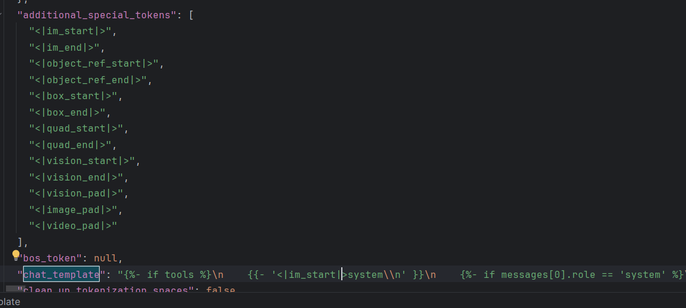

# 🧠 LLM 微调笔记：SFT 调参技巧与关键概念

在前文中，我们讲了微调过程中最核心的两种方法：
**Full Finetune** 与 **LoRA（Low-Rank Adaptation）**。
它们通常以 **SFT（Supervised Fine-Tuning）** 的形式进行训练。

本节主要总结一些 **SFT 调参与技巧（Tricks）**，帮助模型在稳定性与效果之间取得更优平衡。

---

## 1️⃣ 学习率设置（Learning Rate）

在后训练阶段（Post-training），学习率的选择至关重要。

> 一般来说，SFT 阶段的学习率应比预训练阶段**小一个数量级**。

**原因：**

* 小学习率能避免参数剧烈更新，防止 **灾难性遗忘（Catastrophic Forgetting）**。
* 过大学习率可能导致模型遗忘预训练中已有的知识。

> 类似传统机器学习中的“分阶段调参”技巧：
>
> * 训练初期使用较大学习率，加快收敛速度；
> * 当 loss 下降到一定程度后，降低学习率，细化优化路径。
>
> 不过在 LLM 后训练中，我们通常一开始就选用较小的学习率，以保留大模型的通用语义能力。

---

## 2️⃣ 特殊 Token（Special Tokens）的作用

特殊 Token 在 LLM 训练中非常关键，它们承担了结构、功能和控制三类作用：

| Token                          | 作用描述                                              | 
|--------------------------------|---------------------------------------------------| 
| `<think>`                      | 表示思考内容，常用于强化模型的“中间推理能力”。              |                                 
| `<im_start>role  xxx <im_end>` | 表示对话中不同角色（如 system、user、assistant）的对话轮次的起始和结束。    |  
| `<taskToken>`                  | 自定义任务标识，用于提示模型当前任务类型（如翻译、总结、代码生成等）。               |          
| `<EOS>`（End of Sequence）       | 序列终止符。若无 EOS，模型可能会无限生成。                           |          
| `<PAD>`（Padding）               | 填充字符，用于将不同长度的样本补齐到同一长度，以便批量并行训练。                  
| `<UNK>`（Unknown）               | 未知字符的占位符，用于处理词表外的 Token。                          |                      

🔹 **注意：**

* 特殊 Token 的使用要与基座模型（base model）保持一致，避免冲突。
* 不同模型厂商（如 LLaMA、Qwen、Baichuan、GLM）定义略有差异，务必参考官方文档。
* 在特定下游任务中，可以**自定义特殊 Token**，帮助模型理解任务边界或上下文结构。

PS：具体内容可以看tokenizer_config.json，

---

## 3️⃣ Prompt 设置技巧

Prompt 是 SFT 的“灵魂”。好的 prompt 能显著提升模型指令理解与泛化能力。

**实践建议：**

1. ❌ 不要所有样本都使用完全一致的 prompt 模板。

   * 否则模型的 attention 可能过度集中在几个词上，导致指令遵循混乱。

2. ✅ 使用多样化的 prompt：

   * 可由不同模型生成（或不同 seed、temperature）。
   * 对于语言到文本任务，可混入错别字、缩写等噪声增强鲁棒性。

3. ✅ 最优策略：

   * 从**真实业务场景**中收集 prompt；
   * 让 LLM 模仿生成变体（paraphrasing）扩充 prompt 数量。

---

## 4️⃣ 数据并行与序列对齐（Batching & Packing）

在大模型训练中，由于 GPU 需要处理 **定长张量（Tensor）**，必须对不同长度的样本进行统一处理。

### ✳️ 常见方案对比：

| 方法             | 原理                        | 优点                      | 缺点                           |
| -------------- | ------------------------- | ----------------------- | ---------------------------- |
| **Padding 并行** | 使用 `<PAD>` 补齐到相同长度        | 简单、通用                   | `<PAD>` 部分仍计算 attention，浪费资源 |
| **Packing 并行** | 将多个短样本拼接成一个长序列，并用 mask 隔离 | 显著提高 GPU 利用率，减少 padding | 实现复杂，需注意样本间隔离                |

> 实践中，SFT 通常会结合 **packing + mask** 策略，
> 以获得更高的 token 利用率和更稳定的梯度效果。

---

## ✅ 小结

| 主题         | 关键要点                 |
| ---------- | -------------------- |
| 学习率        | SFT 阶段用小学习率，防止灾难性遗忘  |
| 特殊 Token   | 用于结构、功能、任务控制，应遵循模型定义 |
| Prompt 多样化 | 增强模型泛化与鲁棒性           |
| Packing 技术 | 提升训练效率，减少无效计算        |

---
 